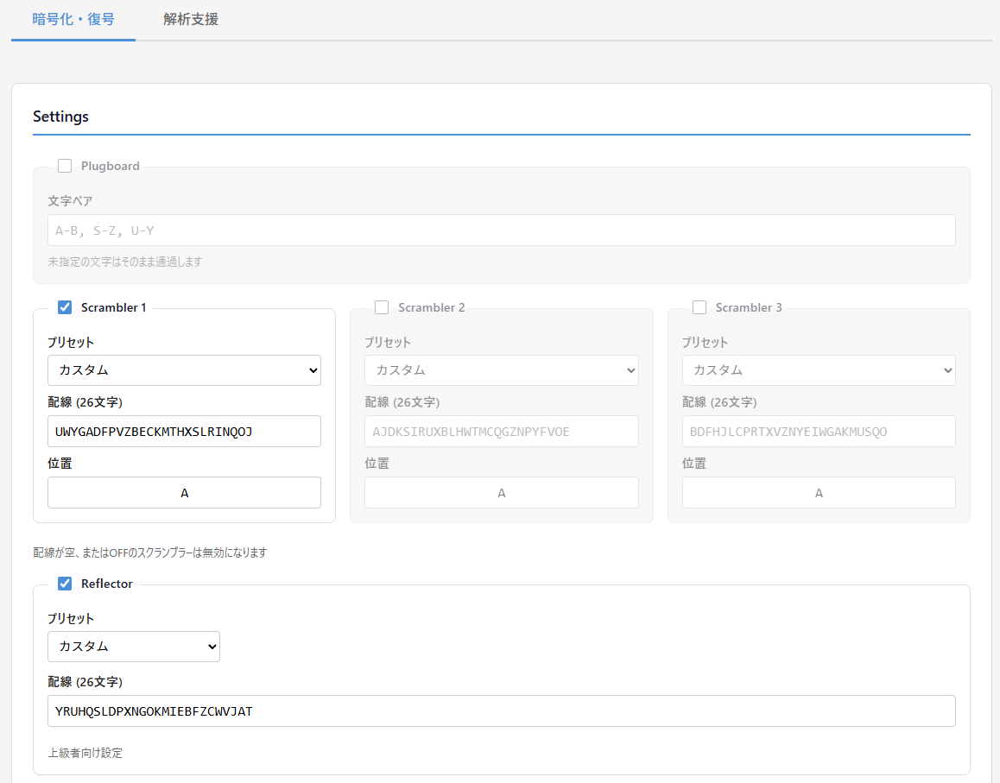
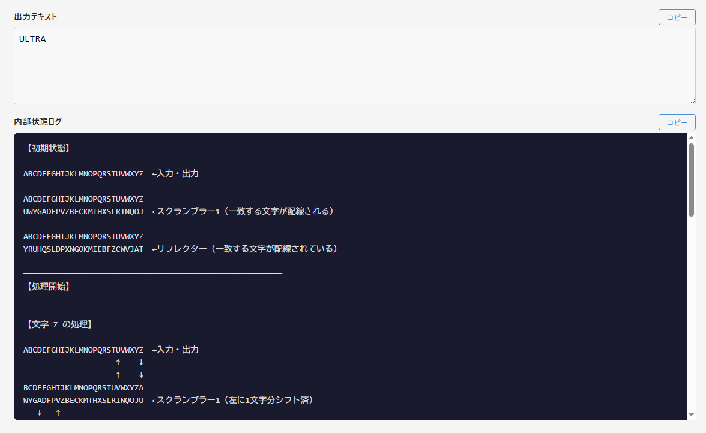

<!--
---
id: day108
slug: cypher-enigma-simulator

title: "Cypher Enigma Simulator"

subtitle_ja: "暗号解読ゲーム「Cypher」用の簡易エニグマシミュレーター"
subtitle_en: "Simplified Enigma simulator for the Cypher puzzle game"

description_ja: "Cypher系パズルで使用されるエニグマ風暗号機を再現・検証するための教育・解析特化型シミュレーター"
description_en: "An educational Enigma-style cipher machine simulator for solving Cypher puzzles"

category_ja:
  - 古典暗号
  - 機械式暗号
  - シミュレーター
category_en:
  - Classical Cryptography
  - Mechanised Cryptography
  - Simulator

difficulty: 4

tags:
  - enigma
  - cipher
  - puzzle
  - cryptography
  - vanilla-js
  - simulator

repo_url: "https://github.com/ipusiron/cypher-enigma-simulator"
demo_url: "https://ipusiron.github.io/cypher-enigma-simulator/"

hub: true
---
-->

# Cypher Enigma Simulator – 暗号解読ゲーム「Cypher」用の簡易エニグマシミュレーター


[](https://ipusiron.github.io/cypher-enigma-simulator/)

**Day108 - 生成AIで作るセキュリティツール200**

Cypherで使用されるエニグマ風暗号機を再現・検証するための教育・解析特化型シミュレーターです。

**注意**: 実機エニグマの完全再現ではありません。パズル仕様に合わせた簡略版です。

---

## 🌐 デモページ

👉 **[https://ipusiron.github.io/cypher-enigma-simulator/](https://ipusiron.github.io/cypher-enigma-simulator/)**

ブラウザーで直接お試しいただけます。

---

## 📸 スクリーンショット

> 
>
> *各種セッティング*

> 
>
> *復号時の内部状態*

---

## ✨ 主な機能

### 暗号化・復号
- プラグボード（文字ペア置換）
- スクランブラー 1〜3枚（プリセット: Enigma I〜V）
- スクランブラーのドラッグ&ドロップ並び替え
- ノッチ機能（カスケード回転制御、ON/OFF切替可能）
- リフレクター（プリセット: Reflector B/C）
- 暗号化/復号モード切替
- リアルタイム処理

### 可視化
- 内部状態ログ（各文字の処理過程を表示）
- 入出力位置の矢印表示（↓↑）
- スクランブラーのシフト状態表示
- ノッチ状態の表示（ON時は位置、OFF時は「OFF」）

### ユーティリティ
- 設定の自動保存（localStorage）
- URL共有（設定をURLパラメーター化）
- 入力バリデーション
- コピー機能（出力・ログ）

### 解析支援：既知平文攻撃
- 暗号文と既知平文の一部からスクランブラー初期位置を探索
- 26^n通りの総当たり探索（1枚: 26、2枚: 676、3枚: 17,576通り）
- 複数の断片的な既知平文に対応
- 探索結果のトレース表示（どの位置で一致したかを確認可能）
- 候補を暗号化・復号タブに適用する機能

---

## 📖 使い方

### 1. 設定

1. 必要に応じてPlugboard、Scrambler 2/3をONにする
2. プリセットを選択するか、配線を直接入力（26文字）
3. 開始位置を指定（A-Z）
4. 必要に応じてノッチ設定を調整（詳細は後述）
5. 暗号化/復号モードを選択
6. スクランブラーの順序を変更したい場合は、ドラッグハンドル（☰）をドラッグして並び替え

### 2. 処理

1. 入力テキスト欄にテキストを入力
2. 「処理実行」ボタンをクリック（またはリアルタイム処理を待つ）
3. 出力テキストと内部状態ログを確認

### 3. 共有

「設定URLをコピー」ボタンで現在の設定をURL化してコピー。リンクを共有すれば、同じ設定を再現可能。

### 4. 既知平文攻撃（解析支援タブ）

スクランブラーの配線はわかっているが、初期位置が不明な場合に使用します。

1. 「解析支援」タブを選択
2. プラグボード、スクランブラー配線、リフレクターを設定
3. 暗号文を入力（自動的に既知平文グリッドが生成される）
4. 既知平文グリッドで、わかっている文字を対応する位置に入力（空欄は「不明」を意味）
5. 「探索実行」ボタンをクリック
6. 候補が見つかったら「設定に適用」ボタンで暗号化・復号タブに反映

---

## 🔬 暗号処理フロー

```
入力 → Plugboard → Scrambler(1→2→3) → Reflector → Scrambler(3→2→1) → Plugboard → 出力
```

各文字処理前にスクランブラーが回転（暗号化: 左シフト、復号: 右シフト）

---

## 🔔 ノッチ機能の詳細

ノッチは、スクランブラーのカスケード回転（連動回転）を制御する機構です。

### 基本概念

エニグマ暗号機では、複数のスクランブラーが連動して回転します。通常、1番目のスクランブラーは毎文字処理前に1回転しますが、2番目以降のスクランブラーは「ノッチ」の条件を満たしたときだけ回転します。

### 仕組み

各スクランブラーには「ノッチ位置」を設定できます：

| 設定 | 動作 |
|------|------|
| ノッチON（例: Z） | 前段スクランブラーが設定位置を超えたとき、次段が1回転 |
| ノッチOFF | 前段スクランブラーが26回回転するごとに、次段が1回転（Z→A時に発動） |

**重要**: ノッチは「そのスクランブラー自身」ではなく「次のスクランブラー」の回転タイミングを決定します。

### ノッチの効果

| スクランブラー位置 | ノッチの効果 |
|-------------------|-------------|
| 1番目 | 2番目のスクランブラーがいつ回転するかを決定 |
| 2番目 | 3番目のスクランブラーがいつ回転するかを決定 |
| 3番目（最後） | 効果なし（後続のスクランブラーがないため） |

### 具体例

**設定**: Scrambler 1のノッチ = C（ON）、初期位置 = A

**暗号化時の動作**:

| 処理文字 | Scrambler 1 位置 | Scrambler 2 動作 |
|----------|-----------------|------------------|
| 1文字目 | A → B | 回転しない |
| 2文字目 | B → C | 回転しない |
| 3文字目 | C → D | **ここで1回転**（ノッチ位置Cを超えた） |
| 4文字目 | D → E | 回転しない |
| ... | ... | ... |

つまり、ノッチ=Cの場合、Scrambler 1が C→D に変化するタイミングで Scrambler 2 が回転します。

### ノッチOFFの場合

ノッチをOFFにすると、従来の26回転で1回カスケードする動作になります。これは実質的に「ノッチ=Z」と同等ですが、明示的にノッチ機能を無効化したい場合に使用します。

### 復号時の注意

復号モードでは回転方向が逆になるため、ノッチの発動条件も逆になります：
- 暗号化: 位置がノッチから次の文字に変化したとき（例: C→D）
- 復号: 位置がノッチの次の文字からノッチに変化したとき（例: D→C）

---

### 既知平文攻撃のアルゴリズム

```
1. 有効なスクランブラー数 n を取得
2. 26^n 通りの初期位置の組み合わせを総当たり
3. 各組み合わせで暗号文を復号
4. 既知平文の位置と文字がすべて一致したら候補として記録
5. すべての候補をリスト表示
```

---

## ⚙️ プリセット配線

### スクランブラー

| 名称 | 配線 |
|------|------|
| Enigma I | EKMFLGDQVZNTOWYHXUSPAIBRCJ |
| Enigma II | AJDKSIRUXBLHWTMCQGZNPYFVOE |
| Enigma III | BDFHJLCPRTXVZNYEIWGAKMUSQO |
| Enigma IV | ESOVPZJAYQUIRHXLNFTGKDCMWB |
| Enigma V | VZBRGITYUPSDNHLXAWMJQOFECK |

### リフレクター

| 名称 | 配線 |
|------|------|
| Reflector B | YRUHQSLDPXNGOKMIEBFZCWVJAT |
| Reflector C | FVPJIAOYEDRZXWGCTKUQSBNMHL |

---

## ⚠️ 非対応事項

以下は意図的に省略しています。

- リング設定
- ダブルステップ（簡略化のため）
- 軍用エニグマ仕様の完全再現

---

## 🎯 ツールの利用例

### ゲーム「Cypher」の暗号文を解読する

- [MECHANISED CRYPTOGRAPHY PUZZLE 01【Cypher編】](https://akademeia.info/?p=36324)
- [MECHANISED CRYPTOGRAPHY PUZZLE 02【Cypher編】](https://akademeia.info/?p=36348)
- [MECHANISED CRYPTOGRAPHY PUZZLE 03【Cypher編】](https://akademeia.info/?p=36372)

---

## 🔧 ローカル実行

```bash
# クローン
git clone https://github.com/ipusiron/cypher-enigma-simulator.git
cd cypher-enigma-simulator

# ブラウザーで開く
open index.html  # macOS
start index.html # Windows
```

---

## 📁 ディレクトリー構造

```
cypher-enigma-simulator/
├── index.html          # メインHTMLファイル
├── style.css           # スタイルシート
├── main.js             # ロジック実装
├── README.md           # 本ドキュメント
├── LICENSE             # MITライセンス
├── .gitignore          # Git除外設定
├── .nojekyll           # GitHub Pages用
├── assets/             # スクリーンショット
└── docs/
    ├── UI_SPEC.md      # 画面仕様書
    └── DETAILED_SPEC.md # 詳細仕様書
```

---

## 📄 ライセンス

- ソースコードのライセンスは `LICENSE` ファイルを参照してください。

---

## 🛠️ このツールについて

本ツールは、「生成AIで作るセキュリティツール200」プロジェクトの一環として開発されました。
このプロジェクトでは、AIの支援を活用しながら、セキュリティに関連するさまざまなツールを100日間にわたり制作・公開していく取り組みを行っています。

プロジェクトの詳細や他のツールについては、以下のページをご覧ください。

🔗 [https://akademeia.info/?page_id=44607](https://akademeia.info/?page_id=44607)
